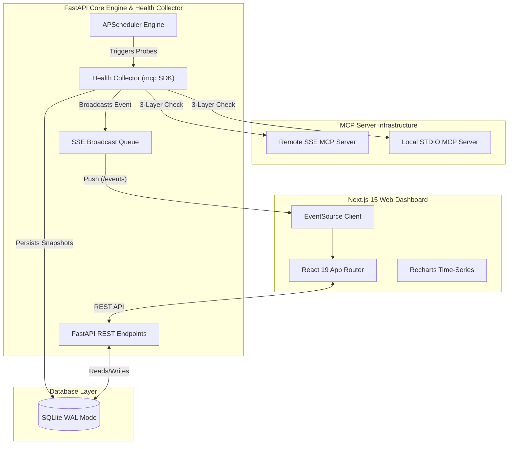

<div align="center">

# ⚡ MCP Server Health Monitor

**Datadog-style real-time observability & health dashboard for Model Context Protocol (MCP) servers.**

[](https://fastapi.tiangolo.com/)
[](https://nextjs.org/)
[](https://www.typescriptlang.org/)
[](https://www.python.org/)
[](https://www.sqlite.org/)
[](https://www.docker.com/)

</div>

---

## Overview

The **MCP Server Health Monitor** provides continuous monitoring, automated health checks, response latency tracking, and tool registry discovery for [Model Context Protocol (MCP)](https://modelcontextprotocol.io/) servers. 

Rather than relying on simple TCP/HTTP ping checks that miss broken JSON-RPC event loops or crashed tool registries, this monitor performs **deep, protocol-level 3-layer health probes** over both **SSE** and **STDIO** transports.

**Created:** June 2025

---

## Key Features

- **3-Layer Health Verification**:
  1. **Liveness**: Transport layer connectivity (HTTP GET / stdio subprocess spawn).
  2. **Readiness**: Full MCP protocol handshake (`initialize` $\rightarrow$ `notifications/initialized` $\rightarrow$ `ping`).
  3. **Functional**: Tool registry integrity check via `tools/list`.
- **Real-Time Live Streaming (SSE)**: Pushes instantaneous probe updates to the dashboard via Server-Sent Events with automatic backoff reconnection.
- **Datadog-Inspired Dashboard**:
  - Dark-first aesthetic (`#0d1117` navy palette with neon-green/red status badges).
  - Time-series latency charts (Average, p95, sparklines).
  - Rolling error rate bar charts.
  - Expandable tool catalog showing registered MCP tools per server.
- **Asynchronous Worker Engine**: APScheduler background loop with per-server configurable intervals and `asyncio.Semaphore` concurrency limits.
- **Automated Data Retention**: Daily purge background job keeps SQLite database file size lean.
- **One-Command Docker Setup**: Launch backend, frontend, database, and background workers instantly.

---

## Architecture



---

## Tech Stack

| Domain | Technology | Description |
| :--- | :--- | :--- |
| **MCP SDK** | `mcp` (Python) | Protocol client for initialization, pinging, and tool listing |
| **Backend Framework** | FastAPI + Uvicorn | High-performance async REST API & SSE streaming |
| **Scheduler** | APScheduler | In-process cron & interval background probe collector |
| **Database** | SQLite + SQLAlchemy (Async) + Alembic | Zero-config, WAL mode for concurrent write safety |
| **Frontend Framework** | Next.js 15 (App Router) + TypeScript | React 19, Server & Client Components |
| **UI & Styling** | Tailwind CSS v4 + shadcn/ui | Dark mode design system, glassmorphism, responsive grid |
| **Visualization** | Recharts | Dynamic response latency & error-rate charts |
| **Containerization** | Docker & Docker Compose | Multi-container setup for effortless deployment |

---

## Directory Structure

```
MCP Server Health Monitor/
├── backend/
│   ├── app/
│   │   ├── api/                # FastAPI Routers (servers, health, stream)
│   │   ├── collector/          # Health probe engine & transport adapters
│   │   ├── utils/              # Structured logging & helpers
│   │   ├── config.py           # Pydantic environment settings
│   │   ├── crud.py             # SQLAlchemy async database CRUD
│   │   ├── database.py         # Async Engine & WAL mode configuration
│   │   ├── main.py             # FastAPI App Lifespan & Middleware
│   │   ├── models.py           # ORM models (MCPServer, HealthSnapshot)
│   │   └── schemas.py          # Pydantic request/response schemas
│   ├── alembic/                # Migration scripts
│   ├── seed_demo_servers.py    # Seed script for initial server seeding
│   ├── Dockerfile
│   └── requirements.txt
│
├── frontend/
│   ├── src/
│   │   ├── app/                # Next.js App Router (pages & layouts)
│   │   ├── components/         # Dashboard UI components (ServerCard, MetricChart, etc.)
│   │   ├── hooks/              # Custom React hooks (useSSE, useServerData)
│   │   └── lib/                # API client, SSE context, TypeScript types
│   ├── Dockerfile
│   └── package.json
│
├── docker-compose.yml          # Unified multi-container deployment
├── plan.md                     # Architecture plan & guidelines
└── README.md                   # Documentation
```

---

## Getting Started

### Option 1: Quickstart with Docker Compose (Recommended)

Run the entire application stack in containers with one command:

```bash
docker-compose up --build
```

- **Frontend Dashboard**: `http://localhost:3000`
- **FastAPI Backend API**: `http://localhost:8000`
- **API Documentation**: `http://localhost:8000/docs`

---

### Option 2: Local Development Setup

#### 1. Backend Setup

```bash
# 1. Navigate to backend
cd backend

# 2. Create virtual environment
python -m venv venv
source venv/bin/activate  # On Windows: venv\Scripts\activate

# 3. Install dependencies
pip install -r requirements.txt

# 4. Set environment variables (or copy .env.example)
cp .env.example .env

# 5. Run Alembic database migrations
alembic upgrade head

# 6. (Optional) Seed demo servers
python seed_demo_servers.py

# 7. Start FastAPI server with live reload
uvicorn app.main:app --reload --port 8000
```

#### 2. Frontend Setup

```bash
# 1. Open new terminal & navigate to frontend
cd frontend

# 2. Install Node.js dependencies
npm install

# 3. Start Next.js development server
npm run dev
```

Visit `http://localhost:3000` in your browser.

---

## API Reference

### Server Management

| Method | Endpoint | Description |
| :--- | :--- | :--- |
| `GET` | `/api/servers` | List all registered MCP servers |
| `POST` | `/api/servers` | Register a new MCP server |
| `GET` | `/api/servers/{id}` | Get server details & latest health snapshot |
| `PATCH` | `/api/servers/{id}` | Update server configuration or toggle `enabled` |
| `DELETE` | `/api/servers/{id}` | Unregister an MCP server |
| `POST` | `/api/servers/{id}/probe` | Trigger an immediate manual health check |
| `GET` | `/api/servers/{id}/history` | Fetch paginated health snapshot history |

### System & Real-Time Stream

| Method | Endpoint | Description |
| :--- | :--- | :--- |
| `GET` | `/api/health` | Backend system health check |
| `GET` | `/events` | SSE Stream — Real-time event feed for live updates |

---

## Configuration Parameters

Settings can be customized via `.env` file in the `backend/` directory:

| Parameter | Default | Description |
| :--- | :--- | :--- |
| `DATABASE_URL` | `sqlite+aiosqlite:///./health_monitor.db` | SQLAlchemy connection string |
| `PROBE_CONCURRENCY` | `20` | Maximum parallel probe workers |
| `DEFAULT_CHECK_INTERVAL` | `30` | Default probe frequency in seconds |
| `PROBE_TIMEOUT_SECONDS` | `10` | Timeout cap per server probe check |
| `HISTORY_RETENTION_DAYS` | `30` | Auto-purge threshold for old snapshots |
| `CORS_ORIGINS` | `["http://localhost:3000"]` | Allowed CORS origins for frontend |

---

## License

Distributed under the MIT License. See `LICENSE` for details.
